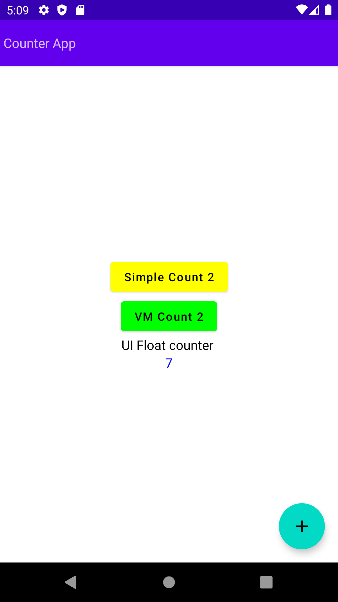

# Simple counter

## Jetpack Compose

### Several state management techniques

- in UI
- in component
- LiveData with ViewModel

## Preview

## References

- [android jetpack compose state](https://semicolonspace.com/android-jetpack-compose-state/)
- [best practise](https://stackoverflow.com/questions/73284058/best-practise-of-using-view-model-in-jetpack-compose)
- [jetpack compose state codelab](https://developer.android.com/codelabs/jetpack-compose-state#0)
- [jetpack compose state codelab video](https://www.youtube.com/watch?v=PMMY23F0CFg)